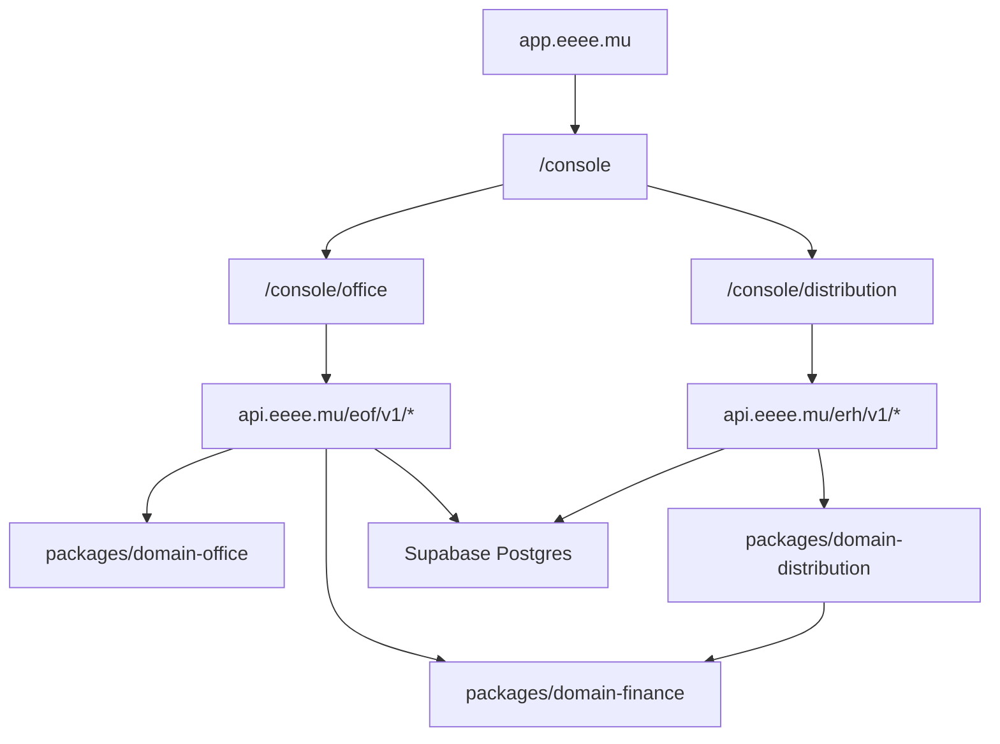

# Functional Coverage — Office + Distribution

This file is the product contract for the visible console surfaces.

Rule: if a page is visible in the left menu, it must have a real UI path, a real
API path, a domain/data owner, and a validation path. Pages without those pieces
must stay hidden until they are implemented.

## Runtime Surfaces

## Status Legend

- `OK`: visible page, API client method, API route, and domain/read path exist.
- `Partial`: visible page and API exist, but engine/persistence/UX is incomplete.
- `Hidden`: should not appear in the menu until implemented.
- `TODO`: code explicitly contains a placeholder or intentional missing engine.

## Office Coverage

| Menu page | UI owner | API surface | Domain/data owner | Status | Next work |
| --- | --- | --- | --- | --- | --- |
| Dashboard | `apps/hq/src/app/canonical/office/App.svelte` | `GET /eof/v1/dashboard`, `GET /eof/v1/screen/office` | `packages/domain-office/src/analytics.ts`, `pl.ts` | OK | Verified 2026-07-16: period/range is carried to live reads; Bank quality, Recent imports, and Recent validated transactions were removed. |
| CEO view | `CeoView.svelte` | Dashboard/P&L aggregate calls through Office client | `domain-office` analytics/P&L | OK | Verified: KPI cards format API fields directly; no KPI money total is recomputed in the UI. |
| P&L | `App.svelte` | `GET /eof/v1/pl/global`, `/pl/category`, `/pl/department/:id`, `/pl/division` | `domain-office/src/pl.ts` | OK | Explicit category read is implemented; category derives division and department through the canonical chart path. |
| Chart of accounts | `App.svelte` | `GET/POST/PATCH/DELETE /eof/v1/plan-comptable` | Office categories/departments/divisions | OK | Create/update/delete persist through Postgres transactions and append audit events. |
| Transactions / Ledger | `App.svelte` | `GET/POST/PATCH /eof/v1/transactions`, validate/cancel | Office transactions + `domain-finance/src/ledger.ts` | OK | Money remains a decimal string at the API edge; writes validate workspace, account currency, category path, and project references. |
| Imports | `App.svelte` | `POST /eof/v1/bank-import/preview`, `/confirm`, reverse/delete | Browser PDF/CSV parser + Office bank import persistence | OK | Raw PDF text stays in the browser; only structured rows reach the API. Repeated MCB page headers are excluded and legacy polluted descriptions are sanitized in the disposable read model. |
| Reconciliation | `App.svelte` | `GET/POST /eof/v1/reconciliations/*` | Office bank matching + `domain-finance/src/reconciliation.ts` | OK | 95%+ suggestions expose classification and require an existing classified ledger transaction; writes are scoped, idempotent, and audited. |
| Pending | `App.svelte` | `GET /transactions?status=pending`, transaction update/validate | Office transactions | OK | Classification stays draft; validation is a separate audited action. |
| Cashflow | `CashflowView.svelte` | `GET /cashflow/workbench`, preview/confirm, `/cashflow/imports/:id/reverse` | `domain-office/src/cashflow.ts` + append-only import batches | OK | CSV batches are audited and reversible; reversal marks the batch void without deleting source rows and restores the preceding baseline. |
| Bank | `BankView.svelte` | `GET/POST/PATCH/DELETE /eof/v1/bank/accounts`, `GET /bank/raw`, `/analytics/bank-quality` | Office bank accounts/raw lines | OK | Raw lines and quality KPIs share the active date range; matched/total counts are explicit. Only empty accounts delete; linked accounts deactivate. |
| Clients | `PartnersView.svelte` | `/eof/v1/partners`, `/pl/partner/:id`, partner payee link | Office partners + Distribution payee link | OK | Verified by facet tests: client means income-side activity; a dual-activity partner can appear in both lenses. |
| Suppliers | `PartnersView.svelte` | `/eof/v1/partners`, `/pl/partner/:id`, partner payee link | Office partners + Distribution payee link | OK | Verified by facet tests: supplier means expense-side activity; a dual-activity partner can appear in both lenses. |
| Projects | `ProjectsView.svelte` | `/eof/v1/projects`, `/pl/project/:id`, coherence violations | Office projects/P&L | OK | Verified in production 2026-07-16 after API deployment: the list endpoint returns promptly and the Projects page renders without the previous stall. |
| Monitoring | `MonitoringView.svelte` | `/integrity/check-all`, `/analytics/bank-quality`, audit/dashboard | Office integrity analytics | OK | Verified: pass → success, warning → warning, and fail → error badges are rendered in the live component. |
| Audit | `App.svelte` | `GET /eof/v1/audit-log` | Postgres `audit_logs` | OK | Audit reads now come from persisted events, not a startup fixture; action, actor, entity, idempotency key, and context are exposed. |
| VAT | `VatView.svelte` | `GET /eof/v1/vat`, transaction create/update | Office VAT report + `domain-finance/src/vat.ts` | OK | Transaction create/edit exposes VAT applicability and rate; the API calculates gross-inclusive VAT with integer finance primitives, persists it, audits the write, and rejects mixed-currency reporting. |
| Settings | `SettingsView.svelte` | `GET/PATCH /eof/v1/settings` | `command_center_settings` + Office audit | OK | Operational default-import-account setting persists to Postgres, is audited, and is consumed by the importer. |
| Wave invoices | Removed from visible menu | none | none | Hidden | Add only when API, data model, and UI workflow exist. |

## Distribution Coverage

Boundary decision: Distribution is a financially separate subledger. Its
payments link only to Distribution statements. No Distribution payment write
creates, edits, matches, or reconciles an Office bank or ledger record; Office
accounting recognition happens later through the normal Office bank-import
workflow.

| Menu page | UI owner | API surface | Domain/data owner | Status | Next work |
| --- | --- | --- | --- | --- | --- |
| Dashboard | `apps/hq/src/app/canonical/distribution/App.svelte` | `GET /erh/v1/dashboard` | `domain-distribution` reads | OK | KPI/readiness/top-royalty cards consume the API projection; the page routes directly into the parity workflow. |
| Imports | `App.svelte` | `/erh/v1/imports/batches`, preview/confirm/reverse | Distribution imports | OK | RouteNote/Kontor structured preview, confirm, status filtering, reversal, batch drill-through, idempotency, and audit are wired. |
| Mapping | `App.svelte` | `/erh/v1/mapping/rows`, `/mapping/apply-rules` | Distribution import mapping | OK | Implemented and live-verified 2026-07-20: the workbench reads the full workspace-scoped Postgres queue instead of the 1,000-row startup snapshot. Search and Unmapped/Suggested/Mapped filters execute server-side, and opaque keyset cursors keep the 97k-row production queue reachable without large offsets. Production QA confirmed the `Spica` search, `mapping_rules` suggestions, and cursor loading from 100 to 200 rows with no console errors. |
| Aliases | `App.svelte` | `GET/POST /erh/v1/aliases`, `PATCH /aliases/:id` | Distribution aliases | OK | Create/edit controls persist canonical targets and append scoped audit events. |
| Duplicates | `App.svelte` | `GET /erh/v1/duplicates`, `POST /duplicates/:id/resolve` | Distribution diagnostics | OK | Explicit keep/merge resolution is idempotent, persisted, audited, and immediately removed from the open duplicate queue. |
| Catalog | `App.svelte` | `/erh/v1/catalog/workbench`, `/catalog/tracks/:trackId/contributor-overrides`, `/releases`, `/tracks` | Distribution catalog | OK | Implemented and live-verified 2026-07-20: full track-centric parity with server-side search; artist-source, ISRC, role, review, label, release-date, and status filters; review KPIs and contributor queue; opaque keyset pagination; release/track creation including label metadata. Contributor corrections are append-only audited snapshots over immutable imports, with idempotent administrator-only writes. Production QA confirmed the `Spica` search, the review editor, cursor loading from 100 to 200 rows, and zero browser diagnostic errors. |
| Contracts / advances | `App.svelte` | `/contracts`, expenses, rules, `/payees` | Distribution contracts + recoupments | OK | Expenses support Advance, Recoupment, Studio, Marketing, Distribution, and Other; they can target a payee or be shared, carry recoverable/date/description fields, and are audited. Payees support artists, staff, suppliers, freelancers, and any other recipient. |
| Financial reconciliation | Hidden compatibility route | `GET /erh/v1/financial-reconciliation`, `POST /financial-reconciliation/actions` | Distribution maintenance diagnostics | Hidden | The WordPress menu has no separate reconciliation page. Statement/payment linking is visible on Statements and Payments; the maintenance API remains available without adding a parity-breaking menu item. |
| Allocations | `App.svelte` | `/allocations/runs`, preview/post/unpost | `domain-distribution/src/allocation.ts` + finance FX/allocation | OK | Exact FIFO recoupment, including dated cross-currency cost recovery, is domain-owned; missing rates route earnings to suspense. Preview/post/unpost remain locked, idempotent, reversible, and audited. |
| Suspense | `App.svelte` | `/suspense`, resolve | Distribution suspense | OK | Filters, exact reason/fix path, canonical resolution actions, pagination, and exact-decimal CSV export are connected. |
| Statements | `App.svelte` | `/statements`, generate/print/void | Distribution statements | OK | Generation, filters, A4 print view, void, balances, and the statement-payment reconciliation queue are connected. |
| Payments | `App.svelte` | `/payments`, record/update/reconcile/void | Distribution payment subledger | OK | Standalone draft/paid payments store payee, exact amount, currency, optional FX, method, reference, date, and notes. Paid records can link to one or more same-payee/same-currency statements; edits, links, voids, CSV export, and all writes are Distribution-only, idempotent, and audited. |
| Revenue | `App.svelte` | `GET /erh/v1/revenue` | Distribution revenue reads | OK | Payee/store/currency/date filters, period grouping, Gross/Allocated/Paid/Suspense KPIs, chart/table views, and exact-decimal CSV export consume API/domain values. |
| Audit log | `App.svelte` | `GET /erh/v1/audit-log` | Postgres `audit_logs` filtered to Distribution actions | OK | Persisted `distribution_*` and compatibility `distribution.*` events are loaded live; the fixture-only read defect is covered by memory and PGlite tests. |
| Settings | `App.svelte` | `GET /erh/v1/settings`, `POST /erh/v1/settings/fx-rates` | Distribution workspace config + finance FX rates | OK | Runtime status/currencies/counts are live; dated FX rates can be saved through a validated, idempotent, audited write. |

## Engine Integration Status

The integration-debt pass is closed for the active runtime paths:

| File | Status | Runtime evidence |
| --- | --- | --- |
| `packages/domain-finance/src/ledger.ts` | CLOSED | Office global P&L is computed once by `domain-office/readGlobalPnl`; the duplicate API `summarizeLedger` pass was removed. Dimension-specific project/category/month summaries remain intentional domain projections. |
| `packages/domain-finance/src/fx.ts` | CLOSED | Effective-date selection and E10 conversion live in the finance kernel. Distribution allocation now consumes the shared rate selection and exact integer conversion path for cross-currency recoupment. |
| `packages/domain-finance/src/schemas.ts` | CLOSED | API write schemas import the shared ISO date, ISO timestamp, currency, decimal-money, and basis-point validators. |
| `packages/domain-office/src/index.ts` | CLOSED | `GET /eof/v1/workbench/snapshot` builds the domain snapshot from live workspace/date-scoped ledger and reconciliation rows, and the Office screen bundle includes it. |
| `packages/domain-distribution/src/statements.ts` | CLOSED | `buildStatementPlan` now creates and consumes the normalized statement draft, so API statement generation uses the primitive on every path. |

Distribution cross-currency recoupment is closed: the allocation engine selects
the effective rate for the earning date, converts with integer E10 arithmetic,
applies the recovered amount in the cost-term currency, and reports recoupment
and net in the earning currency. No float or UI-side conversion is involved.

## Implementation Order

1. Keep Office and Distribution financial writes separate.
2. Keep every visible Distribution page at the parity gate: UI loads, API route
   responds, write path persists, audit event exists, and the exact route is
   verified after deployment.
3. Continue auditing new calculation paths against the finance kernel before
   they are exposed through an API or UI.
4. Add tests at the domain layer first, then API tests, then browser smoke.
