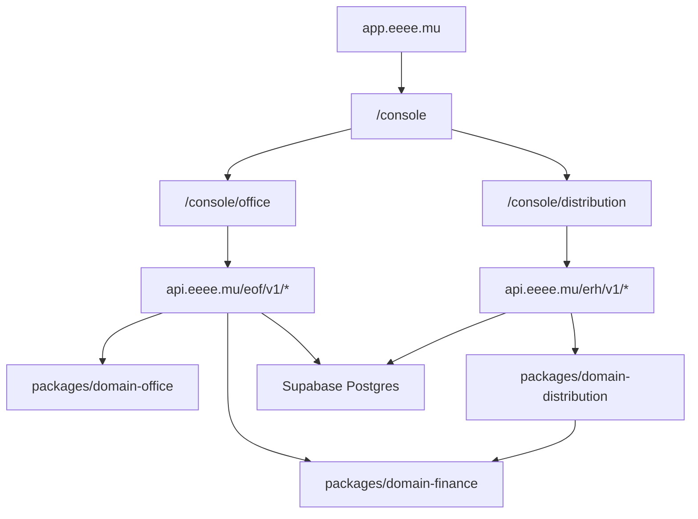

# Functional Coverage — Office + Distribution

This file is the product contract for the visible console surfaces.

Rule: if a page is visible in the left menu, it must have a real UI path, a real
API path, a domain/data owner, and a validation path. Pages without those pieces
must stay hidden until they are implemented.

## Runtime Surfaces

## Status Legend

- `OK`: visible page, API client method, API route, and domain/read path exist.
- `Partial`: visible page and API exist, but engine/persistence/UX is incomplete.
- `Hidden`: should not appear in the menu until implemented.
- `TODO`: code explicitly contains a placeholder or intentional missing engine.

## Office Coverage

| Menu page | UI owner | API surface | Domain/data owner | Status | Next work |
| --- | --- | --- | --- | --- | --- |
| Dashboard | `apps/hq/src/app/canonical/office/App.svelte` | `GET /eof/v1/dashboard`, `GET /eof/v1/screen/office` | `packages/domain-office/src/analytics.ts`, `pl.ts` | OK | Verified 2026-07-16: period/range is carried to live reads; Bank quality, Recent imports, and Recent validated transactions were removed. |
| CEO view | `CeoView.svelte` | Dashboard/P&L aggregate calls through Office client | `domain-office` analytics/P&L | OK | Verified: KPI cards format API fields directly; no KPI money total is recomputed in the UI. |
| P&L | `App.svelte` | `GET /eof/v1/pl/global`, `/pl/category`, `/pl/department/:id`, `/pl/division` | `domain-office/src/pl.ts` | OK | Explicit category read is implemented; category derives division and department through the canonical chart path. |
| Chart of accounts | `App.svelte` | `GET/POST/PATCH/DELETE /eof/v1/plan-comptable` | Office categories/departments/divisions | OK | Create/update/delete persist through Postgres transactions and append audit events. |
| Transactions / Ledger | `App.svelte` | `GET/POST/PATCH /eof/v1/transactions`, validate/cancel | Office transactions + `domain-finance/src/ledger.ts` | OK | Money remains a decimal string at the API edge; writes validate workspace, account currency, category path, and project references. |
| Imports | `App.svelte` | `POST /eof/v1/bank-import/preview`, `/confirm`, reverse/delete | Browser PDF/CSV parser + Office bank import persistence | OK | Raw PDF text stays in the browser; only structured rows reach the API. Repeated MCB page headers are excluded and legacy polluted descriptions are sanitized in the disposable read model. |
| Reconciliation | `App.svelte` | `GET/POST /eof/v1/reconciliations/*` | Office bank matching + `domain-finance/src/reconciliation.ts` | OK | 95%+ suggestions expose classification and require an existing classified ledger transaction; writes are scoped, idempotent, and audited. |
| Pending | `App.svelte` | `GET /transactions?status=pending`, transaction update/validate | Office transactions | OK | Classification stays draft; validation is a separate audited action. |
| Cashflow | `CashflowView.svelte` | `GET /cashflow/workbench`, preview/confirm, `/cashflow/imports/:id/reverse` | `domain-office/src/cashflow.ts` + append-only import batches | OK | CSV batches are audited and reversible; reversal marks the batch void without deleting source rows and restores the preceding baseline. |
| Bank | `BankView.svelte` | `GET/POST/PATCH/DELETE /eof/v1/bank/accounts`, `GET /bank/raw`, `/analytics/bank-quality` | Office bank accounts/raw lines | OK | Raw lines and quality KPIs share the active date range; matched/total counts are explicit. Only empty accounts delete; linked accounts deactivate. |
| Clients | `PartnersView.svelte` | `/eof/v1/partners`, `/pl/partner/:id`, partner payee link | Office partners + Distribution payee link | OK | Verified by facet tests: client means income-side activity; a dual-activity partner can appear in both lenses. |
| Suppliers | `PartnersView.svelte` | `/eof/v1/partners`, `/pl/partner/:id`, partner payee link | Office partners + Distribution payee link | OK | Verified by facet tests: supplier means expense-side activity; a dual-activity partner can appear in both lenses. |
| Projects | `ProjectsView.svelte` | `/eof/v1/projects`, `/pl/project/:id`, coherence violations | Office projects/P&L | OK | Verified in production 2026-07-16 after API deployment: the list endpoint returns promptly and the Projects page renders without the previous stall. |
| Monitoring | `MonitoringView.svelte` | `/integrity/check-all`, `/analytics/bank-quality`, audit/dashboard | Office integrity analytics | OK | Verified: pass → success, warning → warning, and fail → error badges are rendered in the live component. |
| Audit | `App.svelte` | `GET /eof/v1/audit-log` | Office audit events | OK | Build gate verifies all 63 idempotent write paths append an audit event. |
| VAT | `VatView.svelte` | `GET /eof/v1/vat` | Office VAT report + `domain-finance/src/vat.ts` | Partial | API report uses the finance VAT primitive; next check is rate/source configuration and live report parity. |
| Settings | `SettingsView.svelte` | `GET/PATCH /eof/v1/settings` | `command_center_settings` + Office audit | OK | Operational default-import-account setting persists to Postgres, is audited, and is consumed by the importer. |
| Wave invoices | Removed from visible menu | none | none | Hidden | Add only when API, data model, and UI workflow exist. |

## Distribution Coverage

| Menu page | UI owner | API surface | Domain/data owner | Status | Next work |
| --- | --- | --- | --- | --- | --- |
| Dashboard | `apps/hq/src/app/canonical/distribution/App.svelte` | `GET /erh/v1/dashboard` | `domain-distribution` reads | OK | Verify live KPIs against statements/allocation data. |
| Imports | `App.svelte` | `/erh/v1/imports/batches`, preview/confirm/reverse | Distribution imports | OK | Confirm RouteNote/Kontor formats in live browser flow. |
| Mapping | `App.svelte` | `/erh/v1/mapping/rows`, `/mapping/apply-rules` | Distribution import mapping | OK | Verify reusable rules persist and audit. |
| Aliases | `App.svelte` | `GET /erh/v1/aliases` | Distribution aliases | Partial | Add create/update alias actions if aliases are meant to be managed here. |
| Duplicates | `App.svelte` | `GET /erh/v1/duplicates` | Distribution diagnostics | Partial | Merge/resolve is still a maintenance action, not product workflow. |
| Catalog | `App.svelte` | `/erh/v1/releases`, `/tracks`, create release/track | Distribution catalog | OK | Add edit/override workflow if source records are immutable. |
| Contracts | `App.svelte` | `/contracts`, expenses, rules | Distribution contracts + recoupments | OK | Verify rule totals and recoupable expense audit. |
| Financial reconciliation | `App.svelte` | `GET /erh/v1/financial-reconciliation` | Distribution reconciliation diagnostics | Partial | Guarded actions need concrete write handlers or explicit maintenance-only labels. |
| Allocations | `App.svelte` | `/allocations/runs`, preview/post/unpost | `domain-distribution/src/allocation.ts` + finance allocation | OK | Confirm workflow lock behavior in production. |
| Suspense | `App.svelte` | `/suspense`, resolve | Distribution suspense | OK | Confirm resolve writes target canonical catalog records. |
| Statements | `App.svelte` | `/statements`, generate/print/void | Distribution statements | OK | Verify A4 print route and balance ledger. |
| Payments | `App.svelte` | `/payments`, record/update/reconcile/void | Distribution payments | OK | Verify payment reconciliation touches Office bank/ledger where expected. |
| Revenue | `App.svelte` | `GET /erh/v1/revenue` | Distribution revenue reads | OK | Verify group-by totals match allocation/statement totals. |
| Audit log | `App.svelte` | `GET /erh/v1/audit-log` | Shared/distribution audit events | Partial | Code notes Distribution has no dedicated audit fixture; verify production source. |
| Settings | `App.svelte` | `GET /erh/v1/settings` | Distribution workspace config | OK | Confirm settings are sufficient for operations. |

## Engine Integration Debt

These files/functions still need integration or removal before claiming the
visible product is fully backed by the shared engine:

| File | Current issue | Product impact |
| --- | --- | --- |
| `packages/domain-finance/src/ledger.ts` | Implemented and now used by Office global P&L/domain paths | Remaining risk is duplicated local summaries outside P&L. |
| `packages/domain-finance/src/reconciliation.ts` | Implemented and used by Office reconciliation write paths | Remaining risk is production-level transaction/audit atomicity. |
| `packages/domain-finance/src/vat.ts` | Implemented and used by the Office VAT API report | Remaining risk is live rate/source configuration parity. |
| `packages/domain-finance/src/fx.ts` | Implemented primitive, adoption incomplete across all FX paths | FX conversion can still be duplicated outside the kernel. |
| `packages/domain-finance/src/schemas.ts` | Implemented schemas, adoption incomplete | API validation still needs to consume shared finance schemas. |
| `packages/domain-office/src/index.ts` | Stable snapshot primitive exists, broader API adoption incomplete | Office still needs a real workbench snapshot wired to live data. |
| `packages/domain-distribution/src/index.ts` | Stable statement draft primitive exists, broader API adoption incomplete | Distribution statement drafting should be wired into statement generation paths where useful. |

## Implementation Order

1. Hide or mark non-functional menu entries.
2. Make every visible Office page pass: UI loads, API route responds, write path
   persists, audit event exists, and live route is verified.
3. Make every visible Distribution page pass the same gate.
4. Continue adopting the finance kernel in remaining local calculation paths,
   starting with FX and shared validation schemas.
5. Add tests at the domain layer first, then API tests, then browser smoke.
