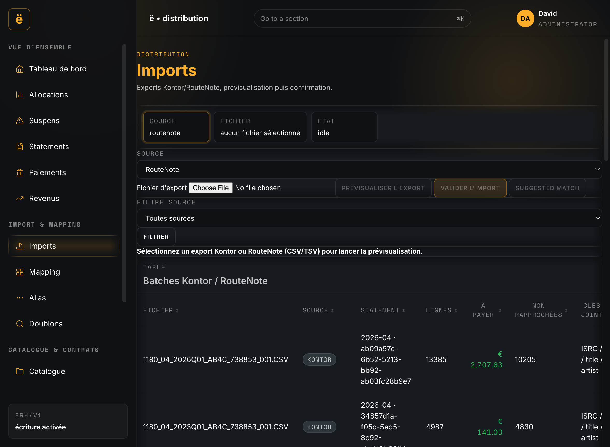
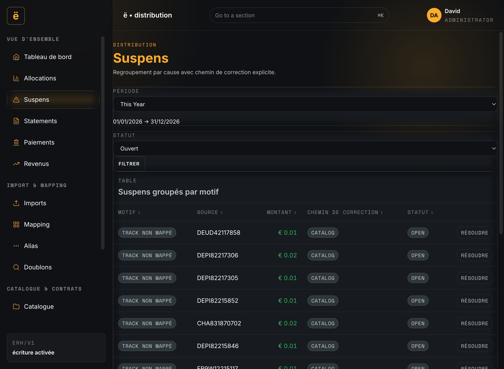
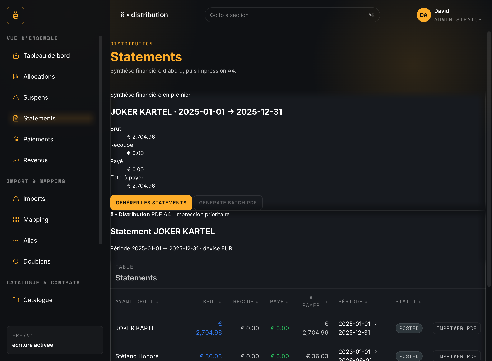
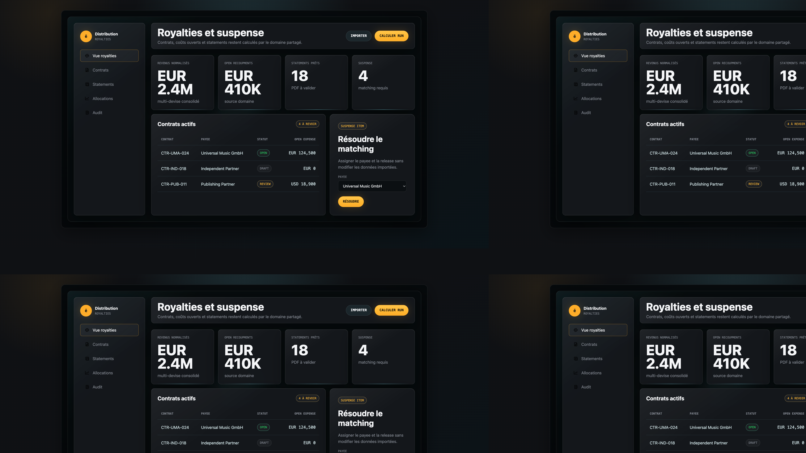
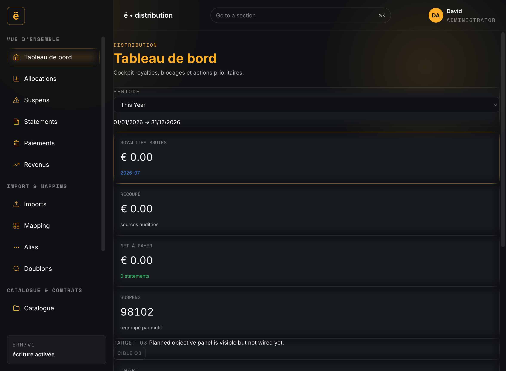

# Distribution Command Theme Delivery Report

Date: 2026-07-11
Branch: theme/distribution-command
Scope: Presentation-only implementation for Distribution pages (Imports, Suspense, Statements, Dashboard).

## Handoff Availability

Expected handoff files from request:
- `ehq_distribution_theme.html`
- `THEME-SPEC.md`

Status in workspace: not found.
Fallback used:
- `design/command-room-kit/templates/distribution.html`
- `design/command-room-kit/styles/tokens.css`
- `design/command-room-kit/styles/components.css`

## Implemented Theme Layer

- Distribution-scoped token bridge and typography layer:
  - `apps/hq/src/distribution-command-scope.css`
- Distribution command component/page overrides:
  - `apps/hq/src/app/canonical/distribution/distribution-command.css`
- Distribution app wiring and per-page presentation updates:
  - `apps/hq/src/app/canonical/distribution/App.svelte`

## Guardrails Respected

- No API endpoint contract changes (`eof/v1`/`erh/v1` unchanged).
- No financial/domain logic changes.
- No PDF generation engine change (only Statements page presentation).
- No heavy dependency added.

## Targeted Page Passes (Requested Order)

1. Imports
- Command styling applied (tokens/chrome/mono values).
- Horizontal table scroll reinforced in-card.
- Kept one primary CTA (`Valider l'import`); `Filtrer` moved to secondary.
- Added visible disabled placeholder `Suggested match` (`coming soon`).

2. Suspense
- Command styling applied to filters/panel/table.
- Existing single primary CTA (`Résoudre`) kept.

3. Statements
- Command styling applied to summary and PDF preview shell.
- Added visible disabled placeholder `Generate batch PDF` (`coming soon`).

4. Dashboard
- Command styling applied to KPIs and action table.
- Added visible disabled placeholder `Cible Q3` (`coming soon`).

## Production Verification

- Frontend deployed to `app.eeee.mu`.
- Smoke routes checked:
  - `/console/distribution/dashboard` -> 200
  - `/console/distribution/imports` -> 200

## Captures (Live vs Canvas)

Live captures:
- `design/distribution-command/captures/live/01-imports.png`
- `design/distribution-command/captures/live/02-suspense.png`
- `design/distribution-command/captures/live/03-statements.png`
- `design/distribution-command/captures/live/04-dashboard.png`

Canvas captures (fallback source available in repo):
- `design/distribution-command/captures/canvas/01-imports-canvas.png`
- `design/distribution-command/captures/canvas/02-suspense-canvas.png`
- `design/distribution-command/captures/canvas/03-statements-canvas.png`
- `design/distribution-command/captures/canvas/04-dashboard-canvas.png`

| Page | Live | Canvas |
|---|---|---|
| Imports |  |  |
| Suspense |  |  |
| Statements |  |  |
| Dashboard |  |  |

## Acceptance Check (Best-Effort Without Missing Spec Section 7)

Validated:
- Theme layer and component overrides are in place and scoped to Distribution workspace.
- Requested page order was implemented and verified.
- Added required "coming soon" placeholders where endpoint coverage is not explicit.
- Focus styling uses orange border/glow semantics.
- Monetary text in KPI/readouts uses EUR display for `formatMicro` outputs.

## Remaining Gaps

1. Missing source-of-truth handoff files
- Exact parity against the intended 5-canvas `ehq_distribution_theme.html` and sectioned `THEME-SPEC.md` could not be validated.

2. Canvas correspondence
- The repository currently contains one Distribution template canvas, reused as per-page fallback reference.

3. One-primary-per-view rule outside requested page quartet
- This pass enforces the rule on Imports/Suspense/Statements/Dashboard as requested; other Distribution views were not normalized in this iteration.
